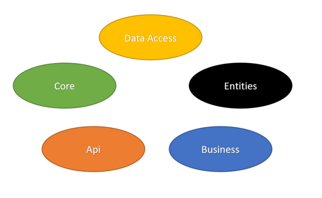

# Goals
  - Clean coding
  - High readability
  - Dependency management by Autofac
  - Authorization Operations

# Layers

### Data Access
> sql conjunction statement definitions
> interface definations

### Entities
> Entities and custom entity definations

### Core
> Authentication operations,generic results
> method to use (entity framework, dapper ...)

### Business
> the part of the transactions where the controls are made

### Api
> Basic level operations are done, such as adding, deleting, updating
